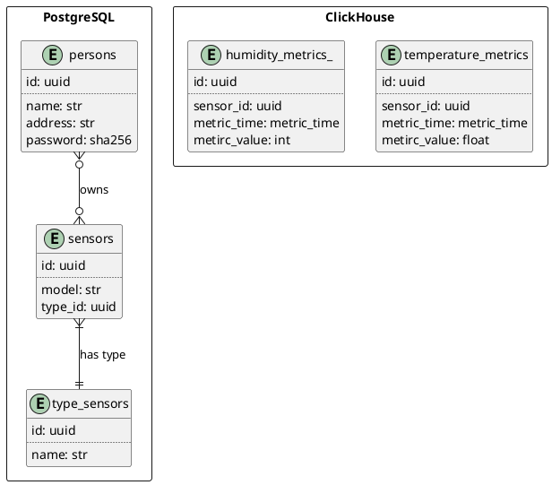

# Задание 1. Анализ и планирование

### 1. Описание функциональности монолитного приложения

**Управление отоплением:**

- Пользователи могут включать/выключать отопление в своих домах.
- Система поддерживает удалённое управление
- Система монтируется только сотрудниками «Тёплый дом»

**Мониторинг температуры:**

- Пользователи могут проверять температуру в своих домах.
- Система поддерживает удалённый мониторинг

### 2. Анализ архитектуры монолитного приложения

Перечислите здесь основные особенности текущего приложения: какой язык программирования используется, какая база данных,
как организовано взаимодействие между компонентами и так далее.

Используется язык программирования Java,     
БД - PostgreSQL  
Приложение синхронное, все взаимодействия последовательные     
Приложение монолитное, поэтому сложно масштабируется


### 3. Определение доменов и границы контекстов

Выделил такие домены:
1. Сбор данных с датчиков, сохранение их в БД  
поддомены:
   - сбор данных температуры
   - сбор данных влажности (в перспективе)
1. Аутентификация
1. Предоставление данных пользователю

### **4. Проблемы монолитного решения**

- Затруднительно масштабировать
- Увеличенное время запросов при высокой нагрузке
- Обновления приложения требую остановки всего приложения
- Над приложением трудно совместно работать нескольким командам
- Даже небольшие изменения приложения требут большого внимания над всей кодовой базой

Пока приложение было небольшим и пользователей было не много, все эти проблемы были не актуальными.  
Возможно уже пора задуматься над более гибким, надежными и maintainability решением. 

### 5. Визуализация контекста системы — диаграмма С4
```plantuml
@startuml
!includeurl https://raw.githubusercontent.com/RicardoNiepel/C4-PlantUML/master/C4_Component.puml
HIDE_STEREOTYPE()

title Контекстная диаграмма C4

Person(user, "Пользователь")
System(app, "Монолитное приложение")
System_Ext(sensors, "Датчики температуры", "Внешние датчики, которые отправляют данные о температуре")
ContainerDb(db, "База данных", "PostgreSQL", "хранит данные о температуре, о пользователях")

Rel(user, app, "Запрашивает данные о температуре", "REST")
Rel(app, db, "Сохраняет и извлекает данные о температуре")
Rel(sensors, app, "Отправляет данные о температуре", "REST")

@enduml
```


# Задание 2. Проектирование микросервисной архитектуры

**Диаграмма контейнеров (Containers)**
```plantuml
@startuml
!include  https://raw.githubusercontent.com/plantuml-stdlib/C4-PlantUML/master/C4_Container.puml
HIDE_STEREOTYPE()

title Диаграмма контенеров C4

Person(user, "Пользователь", "Владелец дома")
Container(front, "Frontend App", "React", "SPA-приложение")
Container(front_2, "Frontend App", "Swift", "iOS-приложение")
Container(front_3, "Frontend App", "Kotlin", "Android-приложение")
Container(gateway_1, "API Gateway", "APISIX Gateway", "Для пользователей")


System_Boundary("domen_4", "Домен Хранения данных") {
  ContainerDb(database, "База данных показаний датчиков", "ClickHouse")
}

System_Boundary("domen_3", "Домен Чтения данных") {
  Container(backend, "Чтение данных", "java", "Возвращает пользователям показания счетчиков")
  ContainerDb(cache, "Cache", "Redis",)
}

System_Boundary("domen_2", "Домен Аутентификация") {
  ContainerDb(database_users, "База данных пользователей", "PostgreSQL", "")
  ContainerDb(cache_auth, "Cache", "Redis", "хранит черный\n(или белый)\nсписок токенов")
  Container(auth, "Аутентификация\nавторизация", "java", "Выдает токены пользователям")
}

System_Boundary("domen_1", "Домен Сбор данных") {
  Container(etl, "Обработка\nданных", "java", "Сервис приводит данные к нужному виду и укладывает в БД")
  Container(gateway_2, "API Gateway", "APISIX Gateway", "Для датчиков")
  Container(datastorage, "Сбор данных", "java", "Собирает данные со всех датчиков и\nприводит к удобному виду для дальнейшей обработки")
  System_Ext(sensors, "Датчики") {
    Container(sensor_1, "Датчик_1")
    Container(sensor_2, "Датчик_2")
    Container(sensor_3, "Датчик_3")
    Container(sensor_4, "Датчик_4")
  }
  ContainerQueue(databus, "Шина данных", "Kafka", "Шина для всех даных с датчиков")
}

Rel(user, front,)
Rel(user, front_2,)
Rel(user, front_3,)
Rel(front, gateway_1,)
Rel(front_2, gateway_1,)
Rel(front_3, gateway_1,)

Rel(sensor_1, gateway_2,)
Rel(sensor_2, gateway_2,)
Rel(sensor_3, gateway_2,)
Rel(sensor_4, gateway_2,)
Rel(gateway_2, datastorage,)
Rel(gateway_1, auth,)
Rel(gateway_1, backend,)

Rel(backend, database, "читает\nданные")
Rel(backend, cache, "cache")
Rel_L(backend, auth, "get_user_sensors")
Rel(auth, database_users,)
Rel(auth, cache_auth,)
Rel(datastorage, databus,)

Rel(etl, databus, )
Rel(etl, database, "записывает\nданные")

@enduml
```
**Диаграмма компонентов (Components)**
```plantuml
@startuml
!include https://raw.githubusercontent.com/plantuml-stdlib/C4-PlantUML/master/C4_Component.puml

!$ICONURL = "https://raw.githubusercontent.com/tupadr3/plantuml-icon-font-sprites/v3.0.0/icons"
!include $ICONURL/common.puml
!include $ICONURL/font-awesome-6/java.puml
!include $ICONURL/font-awesome-6/users.puml
!include $ICONURL/devicons/redis.puml
!include $ICONURL/devicons/postgresql.puml

HIDE_STEREOTYPE()

title Диаграмма компонентов "Auth-сервис"


Person(user, "Пользователь", "Владелец дома", $sprite="users")

Container_Boundary(backend, "Приложение аутентификации и авторизации") {
  Component(signup, "Регистрация пользователя", "java", "Обрабатывает запросы на регистацию", $sprite="java")
  Component(add_sensor, "Регистрация нового датчика", "java", "Обрабатывает запросы на регистацию", $sprite="java")
  Component(signin, "Аутентификация пользователя", "java", "Аутентифицирует и авторизует", $sprite="java")
}
ComponentDb(database, "База данных", "PostgreSQL",  "Хранит учетные данные пользователей", $sprite="postgresql")
ComponentDb(cache, "База данных\nтокенов", "Redis",  "Хранит белый\n(или черный)\nсписок токенов", $sprite="redis")

Rel(user, signup, "Отправляет логин, пароль и тд.", "https")
Rel(signup, user, "Возвращает JWT-токен", "https")

Rel(user, signin, "Отправляет логин и пароль", "https")
Rel(signin, user, "Возвращает JWT-токен", "https")
Rel(signin, cache, "добавляет токены\nв список",)
Rel(signin, cache, "сверяется\nсо списоком",)
Rel(signin, database, "получает данные пользователя",)

Rel(signup, database, "Запись учетных данных",)

Rel(user, add_sensor, "Отправляет post-запрос", "https")
Rel(add_sensor, database, "Добавляет новый датчик пользователя", "")

@enduml
```

```plantuml
@startuml
!include https://raw.githubusercontent.com/plantuml-stdlib/C4-PlantUML/master/C4_Component.puml

!$ICONURL = "https://raw.githubusercontent.com/tupadr3/plantuml-icon-font-sprites/v3.0.0/icons"
!include $ICONURL/common.puml
!include $ICONURL/font-awesome-6/java.puml
!include $ICONURL/font-awesome-6/users.puml
!include $ICONURL/devicons/redis.puml
!include $ICONURL/devicons/postgresql.puml

HIDE_STEREOTYPE()

title Диаграмма компонентов "Получить данные датчиков"

Person(user, "Пользователь", "Владелец дома", $sprite="users")
Container_Boundary(auth, "Auth-сервис") {
    
}
Container_Boundary(backend, "Приложение возвращает\nпоказания датчиков") {
  Component(get_data, "Получить данные датчиков", "java", "Возвращает агрегированные данные", $sprite="java")
}
ComponentDb(cache, "Кэш\nактуальных показаний", "Redis",  "Хранит недавно агрегированные показания", $sprite="redis")
ContainerDb(database, "База данных показаний датчиков", "ClickHouse", "Хранит показания датчиков")


Rel_U(get_data, user, "Возвращает показания", "https")
Rel_D(user, get_data, "Отправляет get-запрос", "https")
Rel_D(get_data, database, "Получает показания", "")
Rel_D(get_data, cache, "Получает актуальные показания", "")
Rel_L(get_data, auth, "Получает список датчиков пользователя", "")


@enduml
```

```plantuml
@startuml
!include https://raw.githubusercontent.com/plantuml-stdlib/C4-PlantUML/master/C4_Component.puml

!$ICONURL = "https://raw.githubusercontent.com/tupadr3/plantuml-icon-font-sprites/v3.0.0/icons"
!include $ICONURL/common.puml
!include $ICONURL/font-awesome-6/java.puml
!include $ICONURL/font-awesome-6/users.puml
!include $ICONURL/devicons/redis.puml
!include $ICONURL/devicons/postgresql.puml
!include $ICONURL/devicons2/apachekafka_original.puml 

HIDE_STEREOTYPE()

title Диаграмма компонентов "Сбор данных"

Container_Ext(sensor_1, "Датчик\nтемпературы 1")
Container_Ext(sensor_2, "Датчик\nтемпературы 2")
Container_Ext(sensor_3, "Датчик\nвлажности 1")
Container_Ext(sensor_4, "Датчик\nвлажности 2")
Container_Boundary(backend, "Приложение получает показания\nот счетчиков") {
  Container_Boundary(temperature, "поддомен температуры") {
    Component(metrics_1, "Сбор показаний температуры", "java", "Передает показания в очередь на обработку", $sprite="java")
    Component(etl_1, "ETL показаний температуры", "java", "Обрабатывает показания и сохраняет в БД", $sprite="java")
  }
  Container_Boundary(humidity, "поддомен влажности") {
    Component(metrics_2, "Сбор показаний влажности", "java", "Передает показания в очередь на обработку", $sprite="java")
    Component(etl_2, "ETL показаний влажности", "java", "Обрабатывает показания и сохраняет в БД", $sprite="java")
  }
    ContainerQueue(databus, "Шина данных", "Kafka", "Шина для всех даных с датчиков",  $sprite="apachekafka_original")
}
ContainerDb(database, "База данных показаний датчиков", "ClickHouse")


Rel(sensor_1, metrics_1, "отправляет\nпоказания", "https")
Rel(sensor_2, metrics_1, "отправляет\nпоказания", "https")
Rel(sensor_3, metrics_2, "отправляет\nпоказания", "https")
Rel(sensor_4, metrics_2, "отправляет\nпоказания", "https")
Rel(metrics_1, databus, "отправляет\nв очередь")
Rel(metrics_2, databus, "отправляет\nв очередь")
Rel(etl_1, databus, "получает\nсообщение\nс показанием")
Rel(etl_2, databus, "получает\nсообщение\nс показанием")
Rel(etl_1, database, "записывает показания")
Rel(etl_2, database, "записывает показания")

@enduml
```
**Диаграмма кода (Code)**

```plantuml
@startuml
!include https://raw.githubusercontent.com/plantuml-stdlib/C4-PlantUML/master/C4_Component.puml

title Получить показания датчиков

package "Сервисы" {

    class FetcherSensorDataService {
        + fetch_temperature()
        + fetch_humidity()
        ..
        - fetch_users_sensors()
    }
    class SensorDataRepository {
        + get_sensor_data()
    }

}

package "Слой данных" {
   package Cache <<Database>> {
      class Redis {
        + get(key)
        + set(key, value)
      }
   }
   package Database <<Database>> {
       class ClickHouse {
           + query(sql)
       }
   }
}

' Взаимодействия
FetcherSensorDataService --> SensorDataRepository
FetcherSensorDataService --> Cache : get/set
SensorDataRepository --> Database : query(sql)

@enduml
```
# Задание 3. Разработка ER-диаграммы

